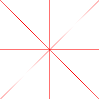

# Задание №6-2

## Условие задачи

Дополните пример из раздела «Пакет img» изображением горизонтальных и вертикальных линий. Воспользуйтесь статьей [«Работа с изображениями»](https://4gophers.ru/articles/rabota-s-izobrazheniyami/).

## Запуск

```bash
go run main.go
```

### Тестирование

```bash
go run main.go && open rectangle.png
```

